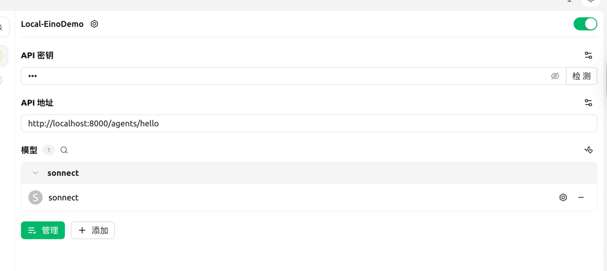

# Quick Start

1- 启动本地 langfuse 服务
```shell
cd scripts/langfuse
docker compose up -d
```

2- 启动 agent 服务
```
export LANGFUSE_PUBLIC_KEY="xxx"
export LANGFUSE_SECRET_KEY="xxxx"
export AM_API_KEY="xxx"
make start
```

3- 在 chat 界面中使用 claude 模型进行对话；

这里建议下载一个 cherry studio 用于看效果：
https://github.com/CherryHQ/cherry-studio/releases

Cherry Studio 配置如下：（密钥随便，因为我们这个 Demo 没有鉴权校验)
